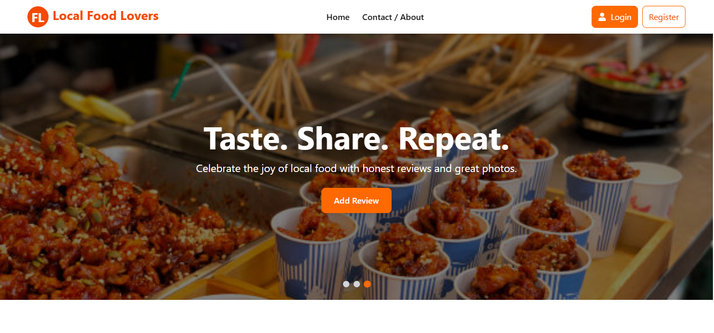

# Local Food Lover

## 📌 Overview
Local Food Lover is a responsive web application where users can explore and order local food items easily.

## 🔗 Live Link
https://local-food-lover-bb58c.web.app/

## 🖼 Screenshot


## 🛠 Technologies Used
- React
- Tailwind CSS
- JavaScript

## ✨ Features
- Browse local food items
- Responsive user interface
- Clean and simple design

## 📦 Dependencies
- react
- daisyui
- sweetaleart
- react-router
- tailwindcss

## ⚙️ How to Run Locally
1. Clone the repository
```bash
git clone https://github.com/archichowdhury4/local-food-lover-client.git
